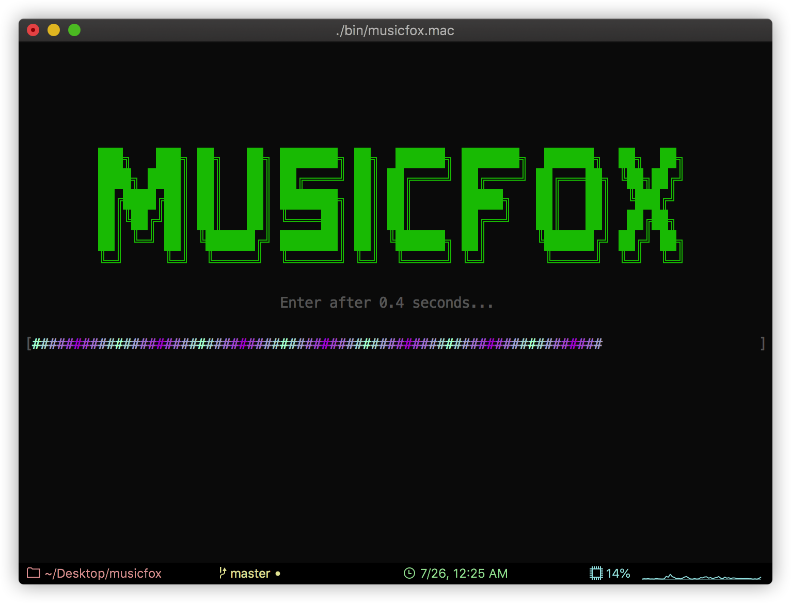
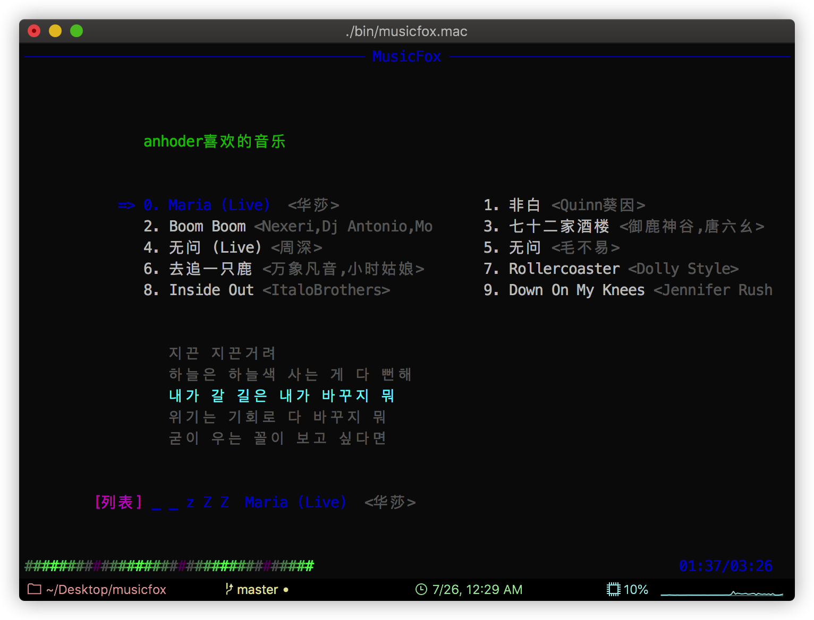
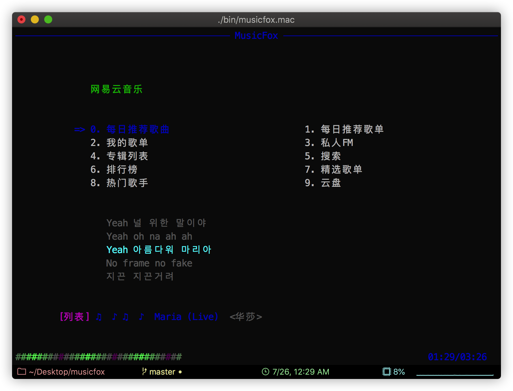

# musicfox

musicfox是一款使用Dart编写的网易云音乐命令行程序。

   

 

## 感谢

感谢以下项目及其贡献者们（不限于）：

* [musicbox](https://github.com/darknessomi/musicbox)
* [NeteaseCloudMusicApi](https://github.com/Binaryify/NeteaseCloudMusicApi)
* [console.dart](https://github.com/DirectMyFile/console.dart)

## 预览






## 安装

**必须先安装mpg123**

### Mac

提供两种方式安装：

1. 使用brew安装: `brew tap AlanAlbert/musicfox && brew install musicfox` 
2. 直接下载[Mac可执行文件](./bin/musicfox.mac)，在iTerm或Terminal中打开

Mac下默认使用AppleScript发送通知。如下：


如果想要更好的通知体验，可以安装`terminal-notifier`:

```sh
brew install terminal-notifier
```

效果如下：


### Linux

直接下载[Linux可执行文件](./bin/musicfox.ubuntu)，在终端中执行。

> 本人没有Linux系统，该执行文件是在WSL2(Ubuntu 2004)下打包的，不保证其他Linux系统也能正常使用

Linux可以安装`libnotify-bin`来使用通知功能（未经测试）

### Windows

**Windows下存在几个已知问题，暂时没有解决方法：**
1. 暂停时会延迟几秒，播放时不会延迟
2. 登录或搜索输入时，会吞掉第一个字符
3. 上、下、左、右及ESC键无法监听，只能使用字母代替这些操作
4. 命令行窗口大小发生变化后，UI会变乱（因为Windows不支持resize事件）

*推荐在WSL下使用，WSL的声音转发可以参考我的另一个[项目](https://github.com/AlanAlbert/wsl-audio-musicbox)*


下载[Windows可执行文件](./bin/musicfox.exe)，在命令行中运行即可。

> 推荐使用Windows Terminal

Windows下可以安装`notifu`实现通知，体验不太好（没找到其他更好的通知工具）

## 使用

```sh
$ musicfox
```

| 按键 | 作用 | 备注 |
| --- | --- | --- |
| h/H/LEFT | 左 | Windows只能使用`h`  |
| l/L/RIGHT | 右 | Windows只能使用`l` |
| k/K/UP | 上 | Windows只能使用`k` |
| j/J/DOWN | 下 | Windows只能使用`j` |
| q/Q | 退出 | Windows只能使用`q` |
| space | 暂停/播放 | |
| [ | 上一曲 | |
| ] | 下一曲 | |
| - | 减小音量 | |
| = | 加大音量 | |
| n/N/ENTER | 进入选中的菜单 | Windows只能使用`n` |
| b/B/ESC | 返回上级菜单 | Windows只能使用`b` |
| w/W | 退出并退出登录 | Windows只能使用`w` |
| p | 切换播放方式 | |
| P | 心动模式(仅在歌单中时有效) | Windows下使用`o` |
| , | 喜欢当前播放歌曲 | |
| < | 喜欢当前选中歌曲 | Windows下使用`;` |
| . | 当前播放歌曲移除出喜欢 | |
| > | 当前选中歌曲移除出喜欢 | Windows下使用`'` |
| / | 标记当前播放歌曲为不喜欢 | |
| ? | 标记当前选中歌曲为不喜欢 | Windows下使用`\` |

## TODO

* [x] 我的歌单
* [x] 每日推荐歌曲
* [x] 每日推荐歌单
* [x] 私人FM
* [x] 歌词显示
* [x] 欢迎界面
* [x] 搜索
    * [x] 按歌曲
    * [x] 按歌手
    * [x] 按歌词
    * [x] 按歌单
    * [x] 按专辑
    * [x] 按用户
* [x] 排行榜
* [x] 精选歌单
* [x] 最新专辑
* [x] 热门歌手
* [x] 云盘
* [x] 播放方式切换
* [x] 喜欢/取消喜欢
* [x] 心动模式/智能模式
* [ ] 音乐电台 
* [ ] 将部分设置转化为文件可配置
    * [ ] 欢迎界面的欢迎语
    * [ ] 欢迎界面时长
    * [ ] 主题色
    * [ ] 歌词显示行数
    * [ ] ...

## 伴生项目

在该项目的开发过程中，我将一些通用的功能模块单独抽离出来，做成了几个伴生项目：

* [mp3_player](https://github.com/AlanAlbert/mp3_player): dart命令行调用mpg123播放音乐
* [colorful_cmd](https://github.com/AlanAlbert/colorful_cmd): 使用dart实现的一些命令行UI组件，如：WindowUI命令行窗口应用UI、RainbowProgress彩虹进度条、NotifierProxy三大平台通知代理、ColorText颜色文本...
* [netease_music_request](https://github.com/AlanAlbert/netease_music_request): Dart实现的网易云音乐接口库，使用Dio发起请求，CookieJar管理Cookie信息


## 项目起因

在开始这个项目的之前，其实是已经有一个基于命令行的网易云音乐项目——[musicbox](https://github.com/darknessomi/musicbox)。

我也使用它听了很长一段时间的歌了，其中还贡献过一些代码，修复几个小问题。那为什么还要重新造一个轮子呢？

> 原因：
> 1. musicbox有一些我特别想要的功能是没有的
> 2. musicbox是使用python进行编写的，而我对python又并不是很熟悉，所以修改或者新增功能时比较麻烦

基于以上，我重新开启了这个项目。

### 为什么使用Dart

1. Dart的语法极像Java，我本身也学过Java，因此学习成本较低；
2. Dart可以将代码编译成能在三大平台（Windows、Linux、Mac）上直接运行的可执行程序。

